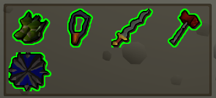
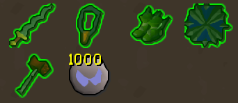
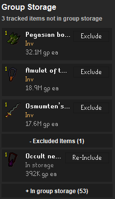
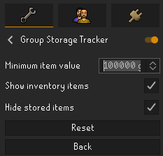

# Group Storage Tracker

Group Storage Tracker is a RuneLite plugin for Group Ironman accounts that helps track valuable shared-storage items which have been withdrawn and not returned.

The plugin learns items from Group Storage, watches bank, inventory, and equipment state, and shows a group storage/bank-only item viewer so you can quickly see what needs to go back into Group Storage.

## Features

- Automatically tracks items seen in Group Storage at or above a configurable GE value.
- Default minimum item value is `50,000 gp`.
- Supports manually included items through right-click menus.
- Shows tracked items that are currently in the bank, inventory, or equipped.
- Optionally tags tracked inventory items while Group Storage is open.

## Bank Viewer

When the bank or Group Storage is open, the plugin displays an inventory-viewer-style overlay containing tracked items that are currently outside Group Storage.

Items are outlined based on the following ruleset:

- **Red**: item is in the bank
- **Green**: item is in inventory
- **Orange**: item is equipped

If an item appears in multiple locations, the overlay can show multiple outlines.

## Inventory Tags

While Group Storage is open, tracked items in the player's inventory can be highlighted with configurable outline and fill colours.

## Sidebar Panel

Once installed, the plugin is available via the Group Ironman icon in the RuneLite sidebar.

Clicking on the sidebar icon shows a window with:

- items currently not in Group Storage
- a collapsible `Manually Included Items` section
- a collapsible `Excluded Items` section with a `Re-Include` button for each item
- a collapsible section for group storage items currently tracked.
- item name, location, quantity, and GE value
- an `Exclude` action for excluding items from the tracking system

## Including Items

Open Group Storage. Any item seen there with a GE value equal to or greater than the configured minimum value will be tracked.

You can also right-click an item in Group Storage, the bank, or your inventory, then choose the option:

```text
Include in group storage tracker
Exclude from group storage tracker
```

`Exclude` is only shown for items that are currently included. Items can also be restored from the sidebar's `Excluded Items` section with the visible `Re-Include` button or context-menu action.

## Excluding Items

Items can be excluded from the tracker UI from the sidebar panel.

Right-click an item in the plugin menu, bank-viewer, bank, or inventory, or use the visible `Exclude` button in the plubin menu.

Automatically tracked items are persisted in the sidebar's `Excluded Items` section until the plugin is reset or the item is re-included.

Excluding a manually included item removes it from manual inclusion instead. It is not added to `Excluded Items`, so it can be learned again later if it meets the automatic value criteria.

## Resetting

The RuneLite plugin reset button clears:

- automatically learned tracked items
- manually included items
- excluded items
- cached Group Storage state
- current sidebar and overlay display state

After resetting, close and reopen Group Storage before letting the plugin learn items again.

## Configuration

### Minimum Item Value

The minimum unit GE value required for automatic tracking.

Default:

```text
50,000 gp
```

Stacks are ignored for this calculation. For example, a stack of cheap runes will not be tracked just because the stack total is high.

When this value changes, automatically learned tracked/excluded items below the new threshold are removed from the tracker. Manually included items are unaffected.

### Display Group Storage Bank View

When enabled, tracked Group Storage items currently in your inventory are included in the bank-view display.

### Inventory Tags

`Outline tracked items in inventory` enables highlighting for tracked items while Group Storage is open.

Defaults:

```text
Outline colour: FF00FF3A
Fill colour:    3D00FF13
Thickness:      0.5 pixels
```

The outline colour, fill colour, and decimal outline thickness are configurable.

## Screenshots

### Bank/Inventory Overlay




### Sidebar Panel



### Configuration



## Notes

This plugin uses local RuneLite client state. It remembers the last confirmed Group Storage contents across game sessions and refreshes that snapshot whenever Group Storage is opened or changed.

Until Group Storage is opened again, the plugin compares the saved snapshot with the current bank, inventory, and equipment state.

## Plugin Hub

Main plugin class:

```text
com.groupstoragetracker.GroupStorageTrackerPlugin
```
